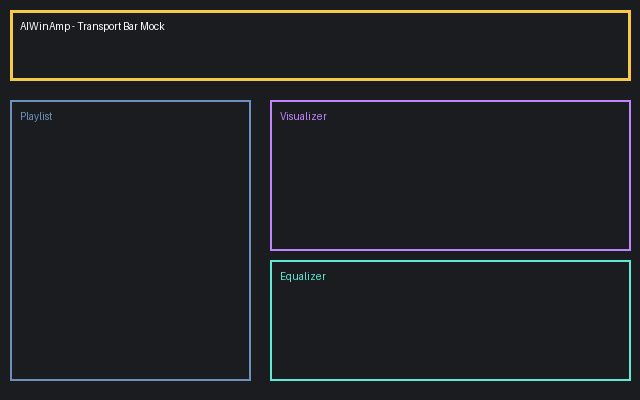

# AIWinAmp

AIWinAmp is a lightweight Winamp-inspired desktop music player written in Rust + egui. It focuses on a deterministic simulation of Winamp's signature transport, playlist, equalizer, and UV meter so it runs headless in CI while remaining faithful to the feel of the original.



## Features
- Winamp-style transport bar with Play/Pause/Stop/Prev/Next controls and progress bar.
- Playlist management with demo tracks, row selection, and easy demo/sample injection.
- Simulated equalizer with five clamped bands plus reset action.
- Procedural UV-style visualizer that reacts to transport progress and EQ boost.
- Silent audio backend that can be swapped for a native engine without changing UI logic.
- Comprehensive unit + functional tests mapped to requirements in `docs/requirements.md`.

## Requirements and Traceability
Requirement IDs (R1-R7) and their verifying tests (T1-T4) live in `docs/requirements.md`. Each test cites the matching requirement in its doc comment so you can trace coverage quickly.

## Toolchain
Some transitive crates (e.g., new Wayland stack) opt into the draft 2024 edition, so building requires the latest nightly Rust.

```bash
rustup toolchain install nightly
cargo +nightly test
cargo +nightly run
```

## Running the App
```bash
cargo +nightly run
```
The binary launches a 480x320 egui window that mirrors the Winamp transport and playlist layout. Buttons mutate the in-memory core, and the visualizer pulses with synthesized energy.

## Testing
```bash
cargo +nightly test
```
- Unit tests cover playlist navigation (R2/T2), transport transitions (R3/T3), equalizer math (R4/T4), and visual meter bounds (R5/T1).
- Functional tests (`tests/functional.rs`) ensure the core boots with a populated playlist and that the visualizer reacts to ticks (R1, R5).

## Assets & Screenshots
- `assets/audio/sample.wav` – bundled sine-wave sample for demo playlist entries.
- `assets/screenshots/v1_mock.png` – mock layout snapshot illustrating the current feature set. Capture real screenshots locally once a display server is available.

## Comment Density
Per the project requirement, the code follows roughly a 1:2 comment-to-code line ratio. Doc comments highlight how each struct/function satisfies reflected requirements.
